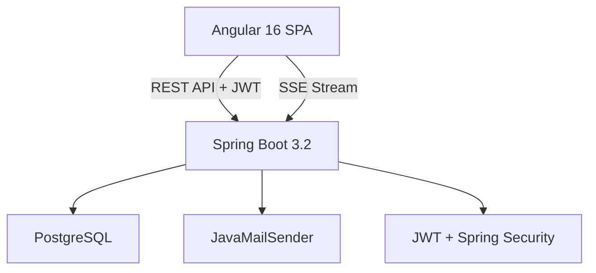
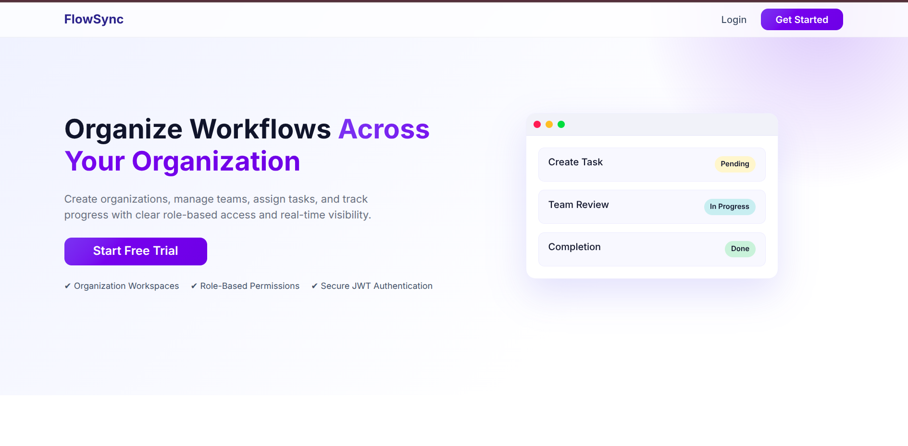
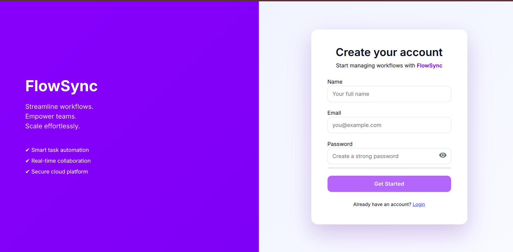
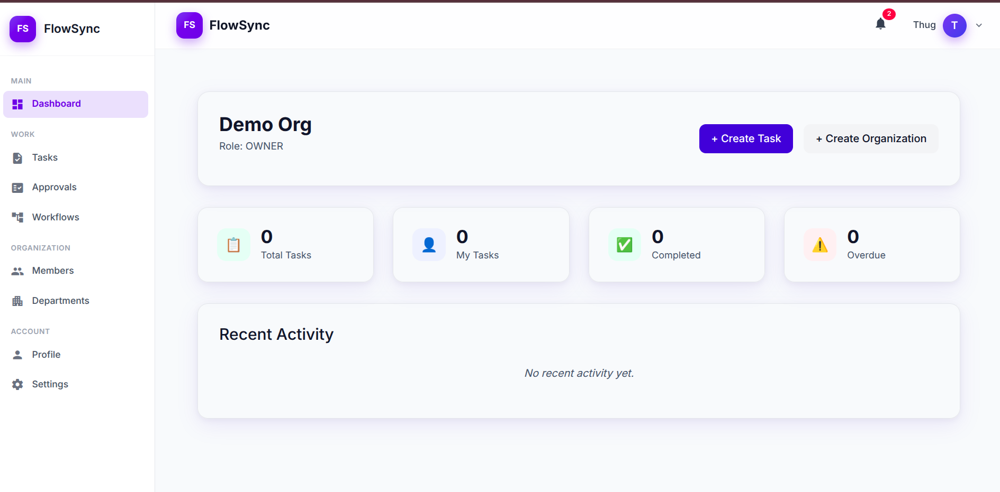
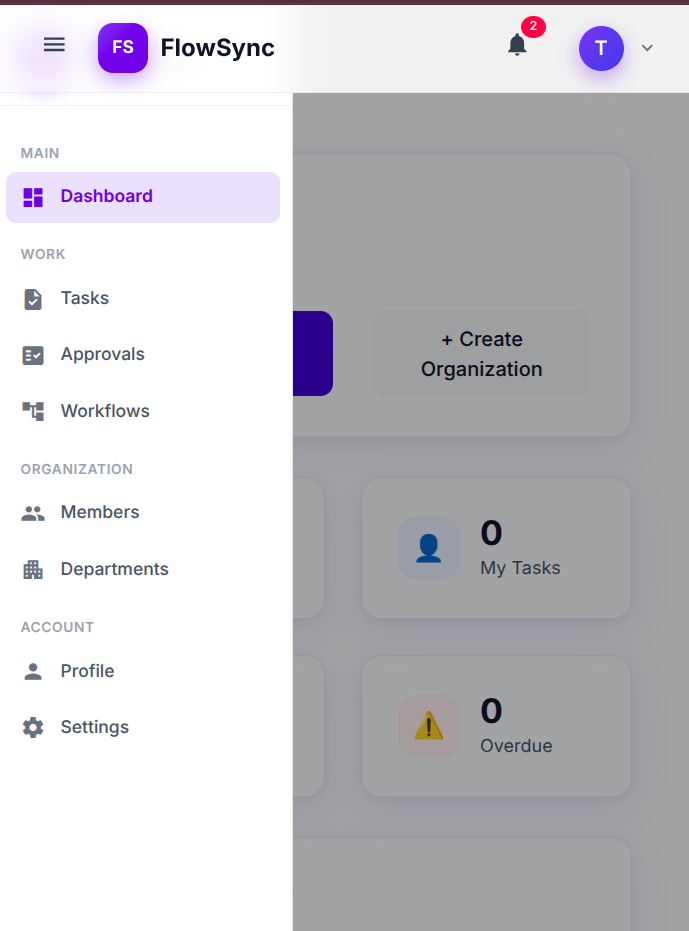

# 🔄 Workflow Management System


> **End-to-end multi-tenant Workflow & Task Management SaaS**
> Built with Angular 16 + Spring Boot 3.2 + PostgreSQL. Features JWT auth, role-based access control, real-time SSE notifications, and an email-based invite system.

---

## 🌟 Overview

FlowSync lets organizations manage work across teams with full role isolation:

- Create and manage **workspaces** — users can belong to multiple orgs and switch between them
- Assign members with **granular roles**: OWNER, ADMIN, MANAGER, EMPLOYEE
- **Create, assign, and track tasks** through a defined status workflow
- **Approve or reject** tasks with reasons (MANAGER+)
- **Invite members** via email with token-based accept/decline flow
- **Real-time notifications** pushed instantly via SSE — no polling
- **Settings** for password management, org configuration, and appearance

---

## 🏗️ System Architecture



1. Angular SPA communicates with the backend via REST and a persistent SSE connection
2. All requests carry a JWT token validated by a custom filter chain
3. Organization-level authorization enforced via a custom `OrgSecurity` bean
4. Notifications pushed in real time to connected clients without polling
5. Email sent for invite creation, acceptance, and decline

---

## 🛠️ Tech Stack

| Layer     | Technology                        | Purpose                              |
|-----------|-----------------------------------|--------------------------------------|
| Frontend  | Angular 16, TypeScript            | SPA, standalone components           |
|           | RxJS, BehaviorSubject             | Reactive state management            |
|           | EventSource API                   | Real-time SSE notification stream    |
|           | CSS3, Flexbox/Grid, Material Icons| Responsive UI                        |
| Backend   | Java 17, Spring Boot 3.2          | REST API, business logic             |
|           | Spring Security 6, JWT            | Auth, RBAC, method-level security    |
|           | Spring Data JPA, Hibernate        | ORM and persistence                  |
|           | JavaMailSender                    | Transactional email delivery         |
|           | Spring MVC SseEmitter             | Real-time push notifications         |
|           | Swagger / OpenAPI                 | API documentation                    |
| Database  | PostgreSQL                        | Multi-tenant persistent storage      |
| Build     | Maven, Node, NPM                  | Build and package management         |

---

## 💎 Feature Highlights

### 🔐 Auth & Onboarding
- JWT-based login and signup with BCrypt password hashing
- Forgot/reset password via email token
- New users guided through org creation before dashboard access
- Guard chain: `AuthGuard → OnboardingGuard → OrgGuard`

### 🏢 Multi-Tenant Workspaces
- Users belong to multiple orgs with independent roles
- Navbar org switcher — switch context without re-login
- Full data isolation per organization

### ✅ Task Management
- Create tasks with title, description, priority, and optional assignee
- Status workflow: `TO_DO → IN_PROGRESS → PENDING → APPROVED/REJECTED`
- Filter by status, assign to members, track overdue tasks
- MANAGER+ can approve or reject with optional rejection reason

### 👥 Members & Invites
- View all org members with roles
- ADMIN+ can invite via email — 48-hour expiry token
- Invite page handles: validation → wrong-account detection → accept/decline
- Wrong account: shows both emails, "Switch Account" clears session and redirects

### 🔔 Real-Time Notifications (SSE)
- Persistent SSE stream per user, established on login
- Unread badge updates instantly — no polling
- Notifications for: task assigned, task approved/rejected, invite accepted/declined
- Mark individual or all as read; auto-reconnect on drop

### ⚙️ Settings
- Change password with current password verification
- OWNER: rename org or delete org (requires typing org name to confirm)
- Non-owners: read-only org info with role badge

### 🍞 Toast System
- Global `ToastService` used across all features
- Success / Error / Info variants with auto-dismiss and slide-in animation

---

## 🧩 Domain Model

| Entity | Description |
|--------|-------------|
| `User` | Platform-level user — email, password, platform role |
| `Organization` | Tenant workspace — owned by a user, soft-deletable |
| `OrganizationMember` | Maps user ↔ org with role (`OWNER/ADMIN/MANAGER/EMPLOYEE`) |
| `Task` | Org-scoped work item — status, priority, assignee, rejection reason |
| `OrgInvite` | Email invite token — 48hr expiry, tracks inviter |
| `Notification` | In-app notification — type, read status, linked to user |

---

## 🔑 Role Permissions

| Action | OWNER | ADMIN | MANAGER | EMPLOYEE |
|--------|-------|-------|---------|----------|
| Rename / Delete org | ✅ | ❌ | ❌ | ❌ |
| Send member invites | ✅ | ✅ | ❌ | ❌ |
| Approve / Reject tasks | ✅ | ✅ | ✅ | ❌ |
| Assign tasks | ✅ | ✅ | ✅ | ✅ |
| Create tasks | ✅ | ✅ | ✅ | ✅ |

---

## 🖼️ Screenshots

### Landing


### Sign Up / Login


### Dashboard


### Notifications


### Members & Invite


### Settings


### Mobile View


---

## ▶️ Getting Started

### Prerequisites
- Java 17+
- Node 18+
- PostgreSQL

### Backend
```bash
git clone https://github.com/Anuj-Gupta79/workflow-management-system
cd workflow-management-system/backend

# Configure application.yml
spring:
  datasource:
    url: jdbc:postgresql://localhost:5432/workflow_db
    username: your_username
    password: your_password
  mail:
    host: smtp.gmail.com
    port: 587
    username: your_email@gmail.com
    password: your_app_password
jwt:
  secret: your_secret_key
  expiration: 86400000

mvn spring-boot:run
# Runs at http://localhost:8080
# Swagger UI: http://localhost:8080/swagger-ui/index.html
```

### Frontend
```bash
cd workflow-management-system/frontend/workflow-ui
npm install
ng serve
# Runs at http://localhost:4200
```

---

## 🚀 Production-Ready Highlights

- Multi-tenant SaaS architecture with full org-level data isolation
- Dual-level RBAC: platform roles + organization roles
- Real-time SSE notifications with auto-reconnect
- Email-based invite flow with token expiry and cross-account detection
- Soft delete across all entities with audit timestamps
- Centralized exception handling with consistent error responses
- Standalone Angular components with reactive BehaviorSubject state
- Clean subscription management with `takeUntil(destroy$)` pattern

---

## 🚧 Planned Improvements

- Refresh token mechanism
- Redis-backed SSE for horizontal scaling
- Pagination and sorting on task/member lists
- Docker + Docker Compose setup
- CI/CD pipeline
- Dark mode

---

## 👨‍💻 Author

**Anuj Gupta**  
[GitHub](https://github.com/Anuj-Gupta79)

Built with SaaS-grade architecture principles demonstrating full-stack production-ready development.