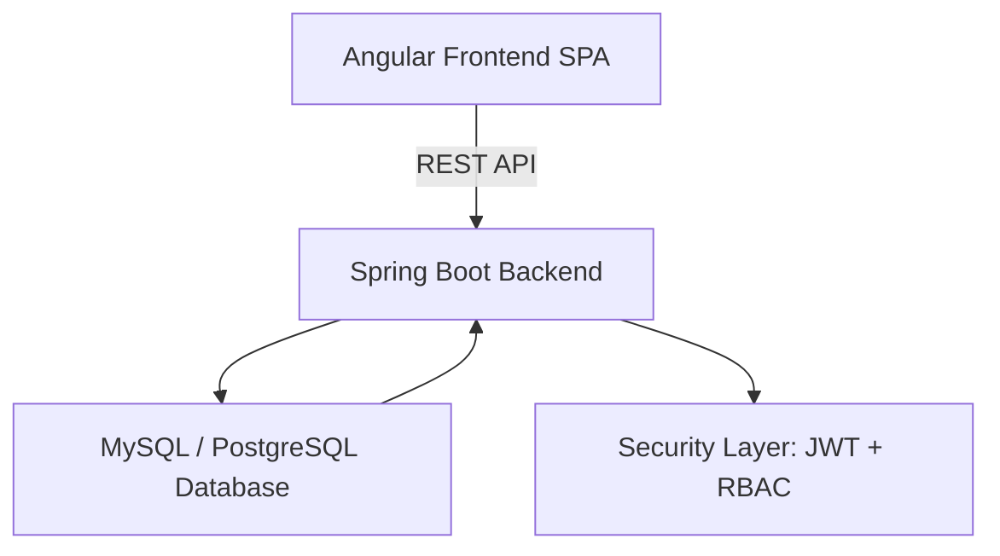
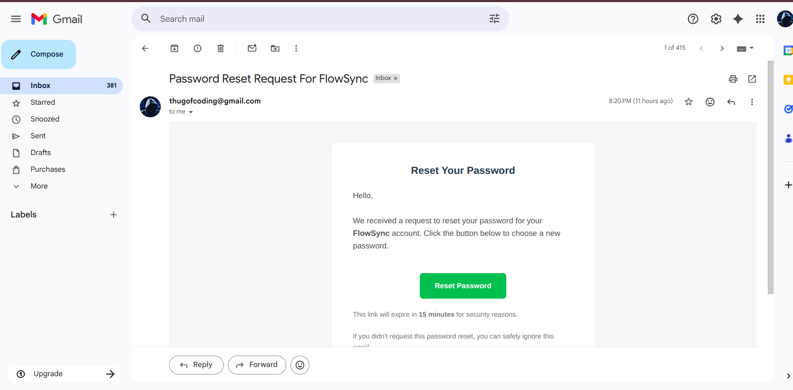
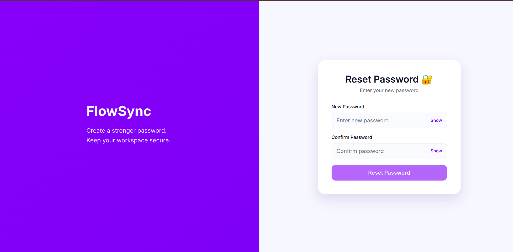

Perfect! Let’s make your **fullstack README fully polished and SaaS-professional** with **GitHub-style badges**—this gives it that “resume & portfolio ready” feel. I’ll add badges for **license, Angular version, Spring Boot version, build status, code coverage**, and some more nice-to-have ones.

Here’s the updated version:

---

# 🔄 Workflow Management System – Fullstack SaaS


> **End-to-end Workflow & Task Management System**
> Multi-tenant SaaS platform with **role-based access**, **secure JWT auth**, and responsive **Angular dashboard**.

---

## 🌟 Project Overview

The **Workflow Management System** allows organizations to:

- Create and manage **workspaces (organizations)**.
- Assign members with **granular roles**: OWNER, ADMIN, MANAGER, EMPLOYEE.
- Track **tasks with status, priority, and assignments**.
- Monitor **recent activity and dashboard metrics**.
- Ensure **secure multi-tenant isolation** and **RBAC**.

> Production-grade SaaS architecture built for scalability and cloud deployment.

---

## 🏗️ System Architecture



**Frontend → Backend → Database** flow:

1. Angular SPA calls REST API via **HttpClient**.
2. Backend authenticates users, enforces **roles**, and manages multi-tenant logic.
3. Database stores users, organizations, tasks, and audit logs.
4. JWT + Spring Security ensures **secure communication**.

---

## 🛠️ Tech Stack

| Layer    | Technology / Tool             | Purpose                                  |
| -------- | ----------------------------- | ---------------------------------------- |
| Frontend | Angular 16+, TypeScript       | SPA, reactive UI, component-based design |
|          | RxJS, BehaviorSubject         | State management & async data streams    |
|          | CSS Grid/Flex, Material Icons | Responsive, modern UI                    |
| Backend  | Java 17+, Spring Boot 3.2     | REST API, business logic                 |
|          | Spring Security + JWT         | Auth & role-based access                 |
|          | Spring Data JPA + Hibernate   | ORM & persistence                        |
| Database | MySQL / PostgreSQL            | Multi-tenant persistent storage          |
| DevOps   | Maven, Node, NPM              | Build & package                          |
| Testing  | Jasmine/Karma, JUnit, Mockito | Unit & integration tests                 |

---

## 💎 Features

### Frontend

- **Dashboard:** Task stats, organization info, and recent activity.
- **Task Management:** Filter, assign, update task status.
- **Organization Management:** Create and manage workspaces.
- **Role-Aware UI:** Dynamically shows/hides components based on user roles.
- **Responsive Design:** Desktop, tablet, and mobile-friendly.
- **Activity Feed:** Displays updates; shows “No recent activity yet” if empty.

### Backend

- **JWT Authentication:** Stateless login with secure tokens.
- **RBAC:** Platform (MASTER_ADMIN, USER) + Organization roles.
- **Multi-Tenant Architecture:** Tenant data isolation per organization.
- **Task Management:** CRUD operations with status, priority, assignments.
- **Global Exception Handling:** Standardized API responses.
- **Soft Delete:** Logical deletion with audit timestamps.

---

## 🧩 Domain Model

| Entity                 | Description                                                                      |
| ---------------------- | -------------------------------------------------------------------------------- |
| **User**               | Platform-level user with email, password, and role                               |
| **Organization**       | Tenant workspace owned by a user                                                 |
| **OrganizationMember** | Maps user to organization with role                                              |
| **Task**               | Scoped to organization; fields: title, description, status, priority, assignedTo |

---

## 🔑 Authentication Flow

1. Sign up / login via frontend → JWT token issued.
2. Store token in `localStorage`.
3. Include token in `Authorization: Bearer <token>` header for all API requests.
4. Backend validates token and enforces **role-based access**.

---

## 🖼️ Screenshots / UI Previews

### Landing


### SignUp/Login


### Reset Password Mail



### Reset Password



### Dashboard Overview


### Responsive Mobile View


---

## ▶️ Getting Started

### Backend

```bash
git clone <backend-repo-url>
cd backend
# configure application.yml with DB credentials
mvn spring-boot:run
```

Server runs at `http://localhost:8080`.

### Frontend

```bash
git clone <frontend-repo-url>
cd frontend
npm install
# update environment.ts with backend API URL
ng serve
```

Frontend runs at `http://localhost:4200`.

---

## 🌐 Example Flow

1. User signs up / logs in → token stored in browser.
2. Creates organization (if none exists) → redirected to dashboard.
3. Dashboard shows **stats, current organization, role, and activity feed**.
4. Task list → create, assign, update status.
5. Members management → add/remove members.
6. Frontend dynamically adapts to user roles.

---

## 🚀 Production-Ready Features

- Multi-tenant SaaS architecture
- JWT + RBAC security
- Modular Angular frontend
- Soft delete + audit timestamps
- Role-based navigation
- Docker-ready & cloud deployable
- CI/CD ready
- Modern responsive UI

---

## 🧪 Testing Strategy

- **Frontend:** Unit tests (Jasmine/Karma), E2E tests (Cypress)
- **Backend:** JUnit + Mockito, integration tests
- Test multi-tenant behavior, RBAC, and dashboard data consistency

---

## 📦 Deployment

- Dockerize frontend & backend
- CI/CD friendly
- Cloud-ready for AWS, Azure, GCP

---

## 👨‍💻 Author

Built with **modern SaaS principles**, clean architecture, and fullstack best practices.
Demonstrates **multi-tenant workflow management** with production-grade quality.

---
